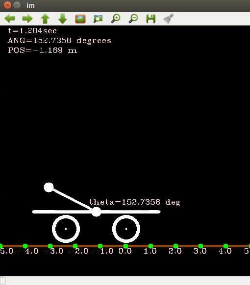
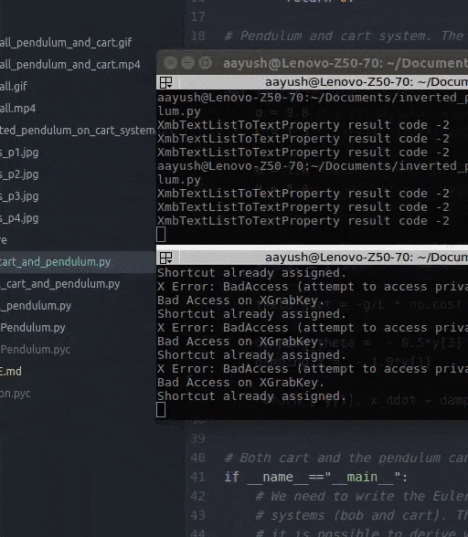
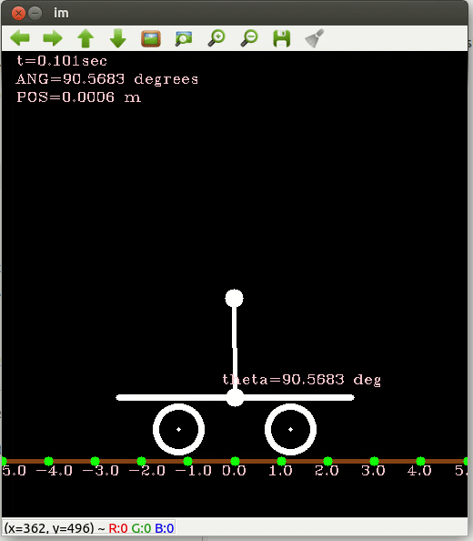
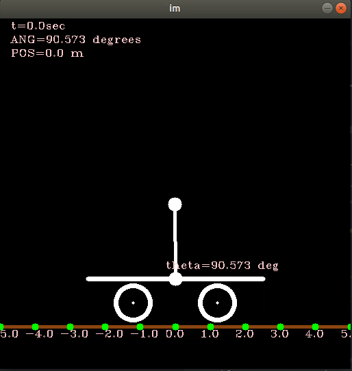

# Inverted Pendulum - Control Systems

I am writing a simple to understand series on controlling real physical systems.
You may access it [here](https://kusemanohar.wordpress.com/tag/control-systems/).

### Inverted Pendulum only System
```
python free_fall_pendulum.py
```
Freefall Inverted Pendulum System


### Inverted Pendulum and Cart System
```
python free_fall_cart_and_pendulum.py
```



### Forced Inverted Pendulum and Cart System
In this example, the motors on the cart are actuated at fixed time.
Thus, they deliver an external force on the system at pre-determined time.
```
python forced_cart_and_pendulum.py
```


### Control Inverted Pendulum and Cart System
In this example, the motors are actuated such that the lineared system
becomes stable. The linearization point is pendulum up (or [0,0,-pi/2,0]).
See also `anaysis_linearization.py` for analysis of linearized system and its
stability.

For this we have made used of the python package [control](https://python-control.readthedocs.io/en/0.8.1/generated/control.lqr.html) for
the functions `pole_place` and `lqr`. In the future will try and
understand how these work and implement these.
There were a few subtle things that need to be mathematically correct for
this to work. Look at the code to know the exact details.
```
python controlled_cart_and_pendulum.py
```


Here is the system stabilized using Eigenvalues as a result of LQR (Linear Quadratic Regular)

